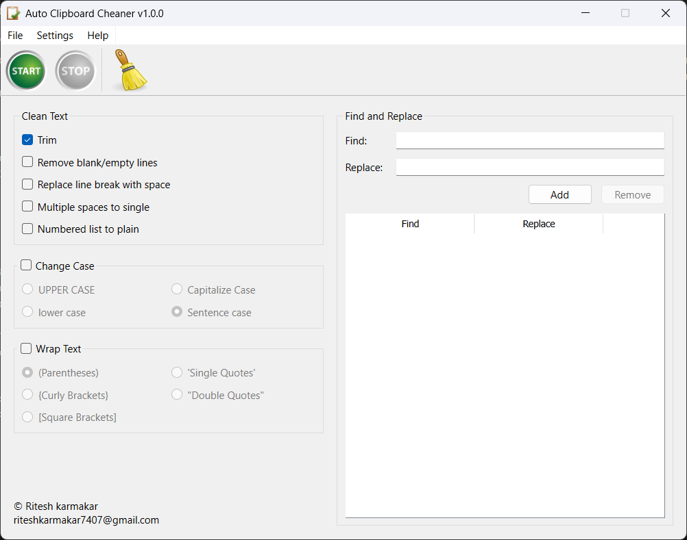

  <h1>Auto Clipboard Cleaner</h1>

  

    <b> Auto Clipboard Cleaner</b> is a powerful windows application designed to automatically clean, format, and enhance your clipboard content. It simplifies text management by applying a variety of cleaning and formatting rules to your copied content, ensuring your clipboard stays organized and clutter-free.
  

  <picture>
    
  </picture>

## Features

### **Automatic Clipboard Cleaning**
- Detects new text copied to the clipboard.
- Cleans and updates the clipboard automatically.

### **Text Trimming Options**
- trim spaces from the start and end of the text.
- Remove blank or empty lines.
- Replace line breaks with spaces.
- Eliminate multiple consecutive spaces.
- Flatten numbered or bulleted lists into plain text.

### **Change case**
  - **Upper Case**: Convert all text to uppercase.
  - **Lower Case**: Convert all text to lowercase.
  - **Capitalize Case**: Capitalize the first letter of each word.
  - **Sentense Case**: Capitalize the first letter of each sentense.

### **Text Wrapping and Replacement**
- Wrap text with different brackets or quotes.
- Find and replace specific text segments efficiently.

## Getting Started

### **Download and Installation**
1. Download the application from [GitHub Releases](https://github.com/riteshkarmakar/auto-clipboard-cleaner/releases).
2. Install the application by following the on-screen instructions.
3. Launch the application to start cleaning your clipboard.

### **How to Use**
1. Click **Start** to begin monitoring the clipboard. The application will automatically format and update the text as you copy it.
2. Continue copying texts, and the application will clean and format them in real time.
3. Click **Stop** to halt the clipboard monitoring whenever you're done.

## Example Scenarios
- **Writing Emails**: Automatically remove unwanted line breaks or spaces from copied text.
- **Programming**: Format code snippets for consistent indentation.
- **Data Entry**: Flatten list formatting and remove extraneous blank lines.
- **Copy text from PDFs**: Copy text from PDFs without extra linebreaks.

## Potential Issues

### Windows Defender False Flagging
This application may be false flagged as a virus by Windows Defender. To exclude the app from being flagged:

1. Open Windows Security.
2. Navigate to **Virus & threat protection**.
3. Click **Manage settings** under **Virus & threat protection settings**.
4. Scroll down and click **Add or remove exclusions** under **Exclusions**.
5. Click **Add an exclusion**, then select **Folder** and choose the folder:

   `C:\Users\<your-username>\AppData\Local\Programs\Auto Clipboard Cleaner`

   Replace `<your-username>` with your actual Windows username.

## Credits
- **Developer**: Ritesh Karmakar
- **External Libraries/Tools Used**:
  - [PySide6](https://pypi.org/project/PySide6/)
  - [requests](https://pypi.org/project/requests/)

## Feedback and Support
If you encounter any issues or have feature suggestions, please reach out via riteshkarmakar7407@gmail.com.

---

Enjoy a cleaner, more organized clipboard experience with Auto Clipboard Cleaner!

